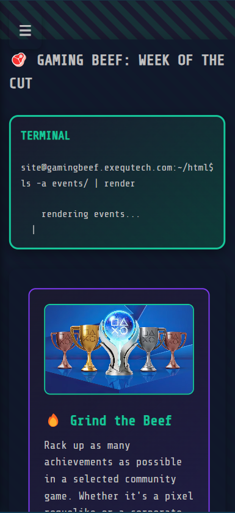

# 🎮 Gaming Beef — Retro Gaming Community Website

Welcome to **Gaming Beef**, a retro-themed gaming community website designed to showcase and manage exciting online and LAN-based events. Built with Node.js and Express, this project offers a playful CRT-style aesthetic, event pages, contact forms, and a terminal-inspired UI.

---

## 🚀 Features

- 🕹 **Event Showcase:** Dynamic event cards with images, descriptions, and dates.
- 📫 **Contact Form:** Users can reach out to the team and receive a confirmation response.
- 💡 **Terminal Aesthetic:** Simulated terminal UI elements for retro vibes.
- 📱 **Responsive Layout:** Hamburger sidebar for mobile navigation.
- ⚡️ **p5.js CRT Shader** Stylized canvas shader effect to simulate old CRT displays.

---

## 🛠 Tech Stack

| Layer        | Tech                          |
|--------------|-------------------------------|
| Server       | Node.js, Express.js           |
| Frontend     | HTML, EJS, CSS (custom + media queries) |
| Styling      | Retro fonts, icons, terminal-style output |
| Optional FX  | [p5.js](https://p5js.org/) with custom shaders |

## Instructions

1. Run `npm install` to install dependencies.
2. Use `npm run dev` to start the development server with nodemon.

## Team Members
- Brian Felgate 600504
- Estian Stander 600899
- Caydan Frank 578131
- Janco Nieuwoudt 600175

## Screenshots
### Home Page

### About Page

### Events Page

### Contact Page

### Mobile View
